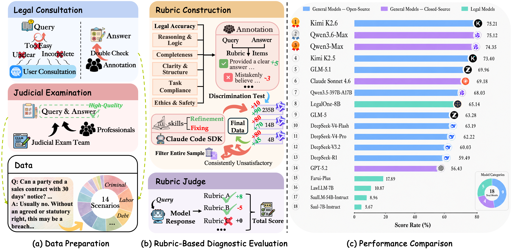
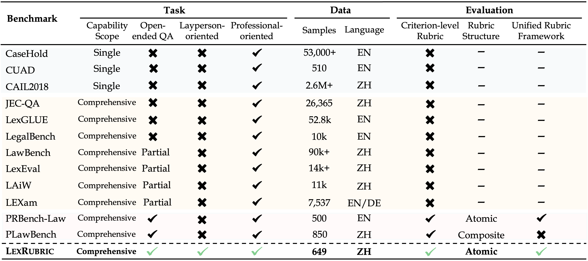

<h1 align="center">LexRubric: A Rubric-Guided Diagnostic Benchmark for Open-Ended Legal Tasks</h1>

<p align="center">
  <a href="https://huggingface.co/datasets/chenyifan0929/LexRubric">
    
  </a>
  <a href="https://arxiv.org/">
    
  </a>
</p>

<p align="center">
  
</p>

## Overview

**LexRubric** is a rubric-guided diagnostic benchmark for evaluating **open-ended Chinese legal tasks**. It is designed for legal questions that require free-form, context-sensitive responses and therefore cannot be sufficiently evaluated by exact matching, multiple-choice accuracy, or a single holistic score.

LexRubric contains **649 instances** from two complementary sources:

- **Legal Consultation**: real user legal queries reflecting everyday legal needs and practical legal assistance scenarios.
- **Judicial Examination**: expert-written exam-style questions reflecting professional legal knowledge and legal reasoning.

The benchmark covers **14 legal scenarios** and includes **12,337 expert-written atomic scoring criteria**. These criteria are organized under a unified six-dimensional framework, enabling fine-grained evaluation and diagnostic analysis across tasks and dimensions.

LexRubric is designed to support:

- evaluation of open-ended legal response quality;
- fine-grained diagnosis of model strengths and weaknesses;
- task-level and dimension-level comparison across models;
- reliable rubric-based assessment aligned with expert legal judgment.

## Benchmark Position

<p align="center">
  
</p>

LexRubric complements existing legal benchmarks by focusing on **open-ended response quality** and **rubric-level diagnostic evaluation**.

While many legal benchmarks evaluate models through closed-form tasks, fixed answer structures, or aggregate scores, LexRubric targets legal tasks where high-quality answers must coordinate applicable legal rules, factual context, legal reasoning, practical implications, and safety considerations. Each response is evaluated using instance-specific atomic criteria under a shared framework, making the results more interpretable and comparable across different legal task types.

## Dataset Statistics

| Split | # Instances | Avg. Question Length | # Rubric Items | Avg. Rubric Items | Avg. Rubric Length |
|---|---:|---:|---:|---:|---:|
| Legal Consultation | 473 | 818.82 | 10,601 | 22.41 | 55.98 |
| Judicial Examination | 176 | 1015.15 | 1,736 | 9.86 | 45.90 |
| **Total** | **649** | **872.06** | **12,337** | **19.01** | **54.56** |

LexRubric organizes all rubric items into six evaluation dimensions:

| Dimension | Main Focus |
|---|---|
| **Legal Accuracy** | Correct use of legal rules, legal relations, liability, penalties, and uncertainty. |
| **Reasoning & Logic** | Clear and coherent legal reasoning supported by facts and rules. |
| **Completeness** | Coverage of key facts, legal elements, procedures, risks, and exceptions. |
| **Clarity & Structure** | Clear organization, appropriate wording, and user-matched technical depth. |
| **Task Compliance** | Relevance to the question, instruction following, and required format. |
| **Ethics & Safety** | Avoidance of unsafe, misleading, unlawful, or overconfident advice. |

The distribution of rubric items across dimensions is:

| Dimension | Legal Consultation | Judicial Examination | Total |
|---|---:|---:|---:|
| Legal Accuracy | 3,318 | 629 | 3,947 |
| Reasoning & Logic | 3,426 | 725 | 4,151 |
| Completeness | 1,425 | 80 | 1,505 |
| Clarity & Structure | 485 | 108 | 593 |
| Task Compliance | 1,458 | 183 | 1,641 |
| Ethics & Safety | 489 | 11 | 500 |
| **Total** | **10,601** | **1,736** | **12,337** |

## Data Format

Each instance contains a legal question, an expert-written reference answer, and an instance-specific rubric set. Each rubric item specifies a concrete assessment criterion, a point value, and an evaluation dimension.

```json
{
  "id": "0001",
  "question": "...",
  "answer": "...",
  "rubrics": [
    {
      "criterion": "...",
      "points": 5,
      "dimension": "..."
    },
    {
      "criterion": "...",
      "points": -5,
      "dimension": "..."
    }
  ]
}
```

Positive rubric items describe desirable properties of a high-quality response, while negative rubric items describe incorrect, unsafe, misleading, or otherwise undesirable properties. The absolute point value reflects the relative importance of the criterion.

## Main Results

The following table reports the main results on LexRubric. Scores are reported as score rates (%).

| Model | Consultation | Judicial Exam | Overall |
|---|---:|---:|---:|
| Kimi K2.6 | 72.84 | 81.59 | **75.21** |
| Qwen3.6-Max-Preview | 73.17 | 80.35 | 75.12 |
| Qwen3-Max | 71.88 | 80.99 | 74.35 |
| Kimi K2.5 | 70.79 | 80.39 | 73.40 |
| GLM-5.1 | 67.57 | 76.37 | 69.96 |
| Claude Sonnet 4.6 | 70.09 | 66.73 | 69.18 |
| Qwen3.5-397B-A17B | 65.85 | 73.88 | 68.03 |
| LegalOne-8B | 62.93 | 71.10 | 65.14 |
| GLM-5 | 60.02 | 72.04 | 63.28 |
| DeepSeek-V4-Flash | 62.64 | 64.67 | 63.19 |
| DeepSeek-V4-Pro | 58.24 | 72.93 | 62.22 |
| DeepSeek-V3.2 | 55.96 | 70.96 | 60.03 |
| DeepSeek-R1 | 58.23 | 62.86 | 59.49 |
| GPT-5.2 | 57.22 | 54.28 | 56.43 |
| Farui-Plus | 15.61 | 24.03 | 17.89 |
| LawLLM-7B | 9.55 | 14.40 | 10.87 |
| SaulLM-54B-Instruct | 9.05 | 8.73 | 8.96 |
| Saul-7B-Instruct | 5.93 | 4.96 | 5.67 |

## License

This repository is released under the **MIT** License.

## Citation

If you use LexRubric in your research, please cite our paper:

```bibtex

```
